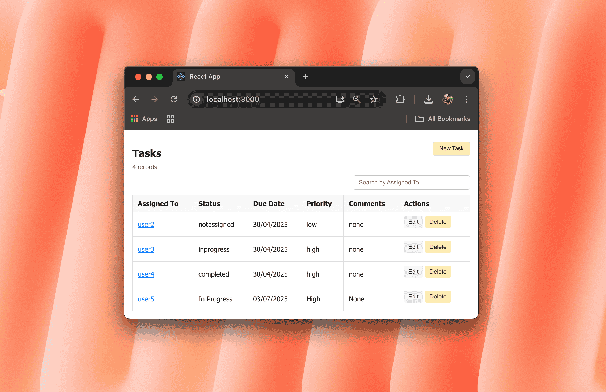
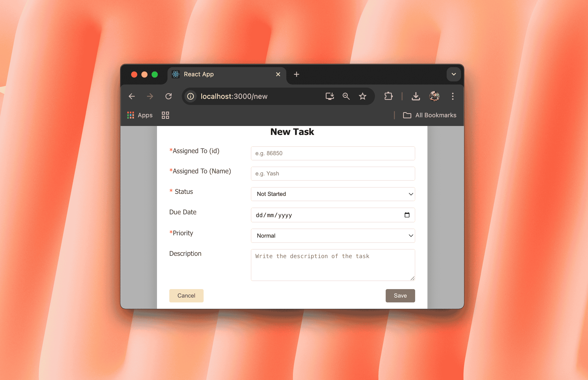
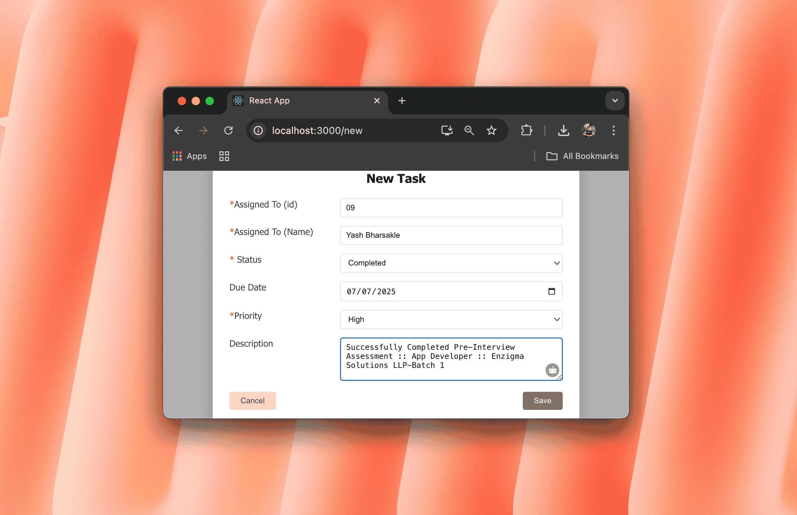
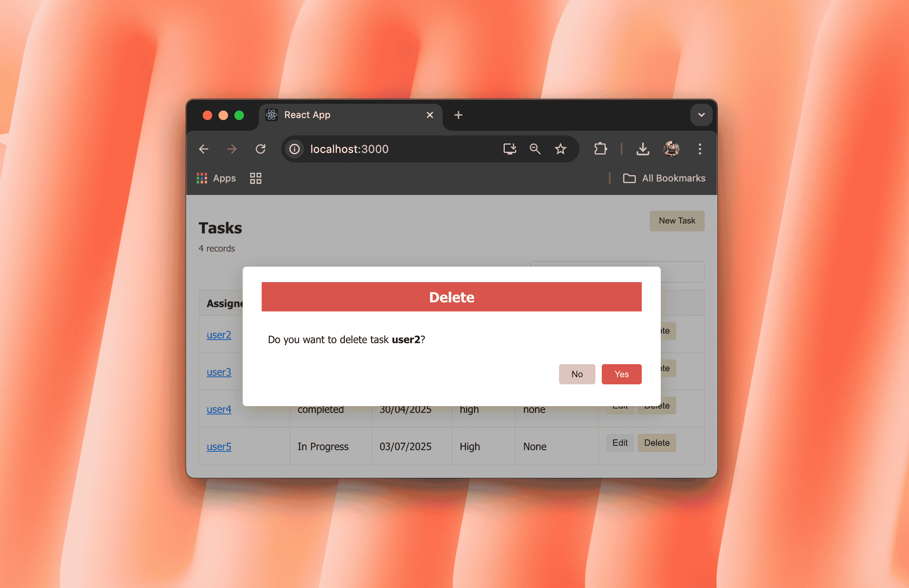
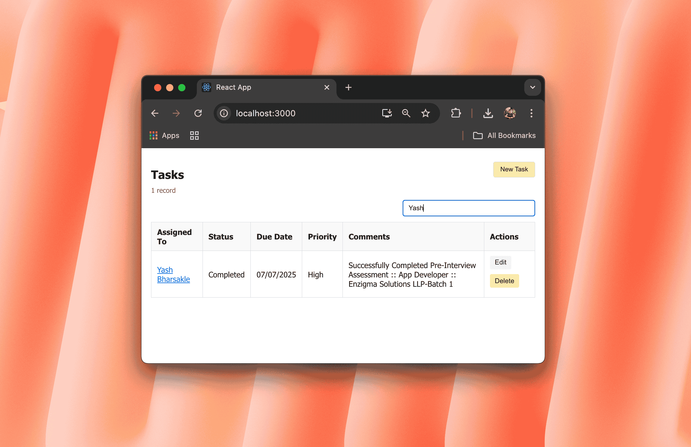

# 📝 ToDoList App

A simple and intuitive To-Do List application built with React, Node.js, Express, and MySQL. This app helps users manage tasks efficiently — add, edit, delete, and track your daily tasks with ease.

## 🚀 Features

- ✅ Add new tasks
- 🖊️ Edit existing tasks
- ❌ Delete completed/unwanted tasks
- 📋 View all tasks in a structured list
- 🔍 Search through your tasks

---

## 📸 Screenshots

| Task List | Add New Task | Task Added |
|------------|--------------|-------------|
|  |  |  |

| Edit Task | Delete Task | Search Task |
|----------|-------------|------------|
|  | |  |

---

## 🛠️ Tech Stack

- **Frontend**: React.js
- **Backend**: Node.js + Express
- **Database**: MySQL
- **API Tool**: Postman

---

## 📦 Installation & Setup

1. **Clone the repository**  
   ```bash
   git clone https://github.com/Yash-Bharsakle/ng-training-assignment--1.git
   cd ng-training-assignment--1
   ```

2. **Install frontend dependencies**
   ```
   cd client
   npm install
   ```
3. **Install backend dependencies**
   ```
   cd ../server
   npm install
   ```

---

## 👨‍💻 Author

**Yash Vijay Bharsakle**
💡 Passionate about Full Stack Development & Mobile App Creation
